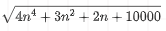

描述机器学习算法好坏的指标常用什么ROC，AUC，精确率和召回率等，机器学习算法也是算法，除了这些，描述算法好坏的一个必备基础指标：时间复杂度，衡量时间复杂度的常见方法：大 O 记号。

的时间复杂度

学术界用大O描述时间的上界，根据[主定理](https://en.wikipedia.org/wiki/Master_theorem_(analysis_of_algorithms))，舍弃常数项（constants）和系数（coefficients）和不重要的项（Non-Dominant Terms），再开方，最后时间复杂度为：

O(n2)
