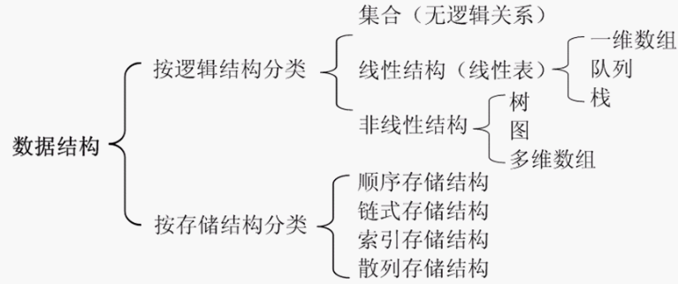

1. 前面学习了一维的、线性的数组、链表等数据结构，今天学习的二叉树又与它们有何不同？总结优缺点
线性结构是一个有序数据元素的集合。 其中数据元素之间的关系是一对一的关系，即除了第一个和最后一个数据元素之外，其它数据元素都是首尾相接的。
常用的线性结构有：线性表，栈，队列，双队列，数组，串。
 
非线性结构中各个数据元素不再保持在一个线性序列中，每个数据元素可能与零个或者多个其他数据元素发生联系。根据关系的不同，可分为层次结构和群结构。
常见的非线性结构有：二维数组，多维数组，广义表，树(二叉树等)，图。（其中多维数组是由多个一维数组组成的，所以不再是线性结构）
 
线性结构特点：
* 集合中必存在唯一的一个"第一个元素"；
* 集合中必存在唯一的一个"最后的元素"；
* 除最后元素之外，其它数据元素均有唯一的"后继"；
* 除第一元素之外，其它数据元素均有唯一的"前驱"。

数据结构中线性结构指的是数据元素之间存在着“一对一”的线性关系的数据结构。
如（a1,a2,a3,.....,an）,a1为第一个元素，an为最后一个元素，此集合即为一个线性结构的集合。

相对应于线性结构，非线性结构的逻辑特征是一个结点元素可能对应多个直接前驱和多个后继，实际情况中用来解决多对多的关系(很多可以分解为1对多)。

的时间复杂度

2.  请写出二叉树的以下概念：路径、根、父节点、孩子、叶结点、子树、访问、遍历、层级和关键码。
的时间复杂度
* Path路径 - 路径是指沿树边缘的节点序列。

* Root根 - 树顶部的节点称为根。每棵树只有一个根，并且从根节点到任何节点只有一条路径。

* Parent父节点 - 除根节点外的任何节点都具有一个称为父节点的上级。

* Child 子节点 - 通过给定节点的下方其向下连接的节点称为该节点的子节点。

* Leaf 叶子 - 没有任何子节点的节点称为叶子节点。

* Subtree子树 - 子树代表节点的后代。

* Visiting访问 - 访问是指检查节点。

* Traversing遍历 - 遍历是指以特定顺序访问节点。

* Levels层级-节点的层级表示节点的生成位置。如果根节点处于级别0，则其下一个子节点处于级别1，其子代处于级别2，依此类推。

* keys - 表示节点的值，基于这个值将对节点执行搜索操作。
