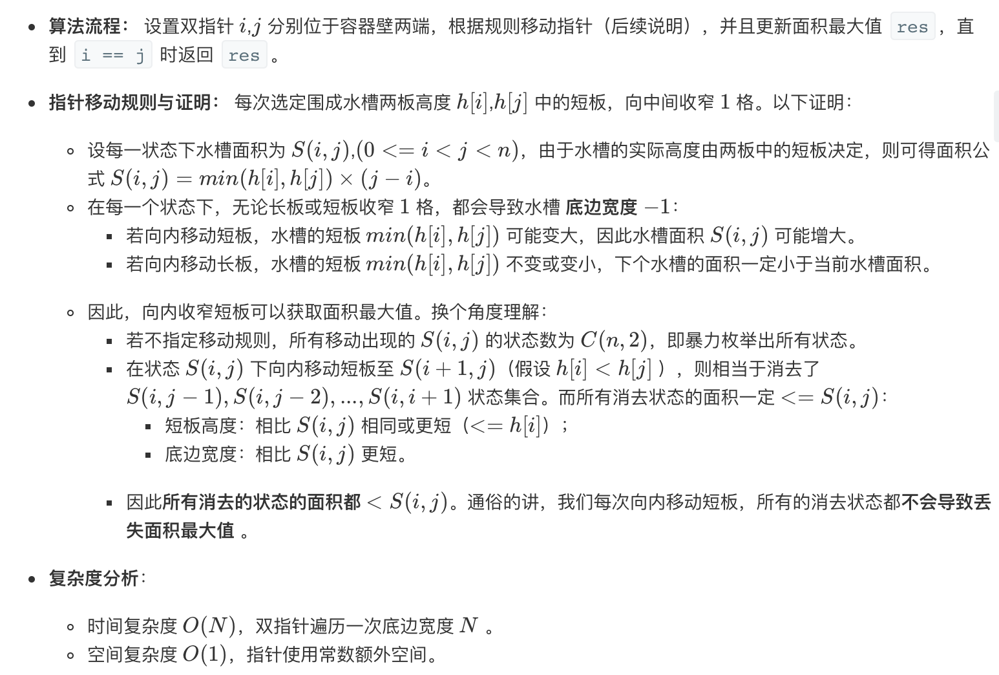

## Solution 1
> 双指针，需要注意的是指针移动的规则，是移动较小的那个bar



```java
class Solution {
    public int maxArea(int[] height) {
        int mostWater = 0;
        if (height == null && height.length <= 1) {
            return mostWater;
        }
        int left = 0;
        int right = height.length - 1;
        while (left < right) {
            mostWater = Math.max(mostWater, (right - left) * Math.min(height[left], height[right]));
            // 把比较短的bar往右或者往左移动一步，因为较短的不可能是最大的容量备选，可证明
            if (height[right] > height[left]) {
                left++;
            } else { // left和right相等的话移动任何一个都行
                right--;
            }
        }
        return mostWater;
    }
}
```