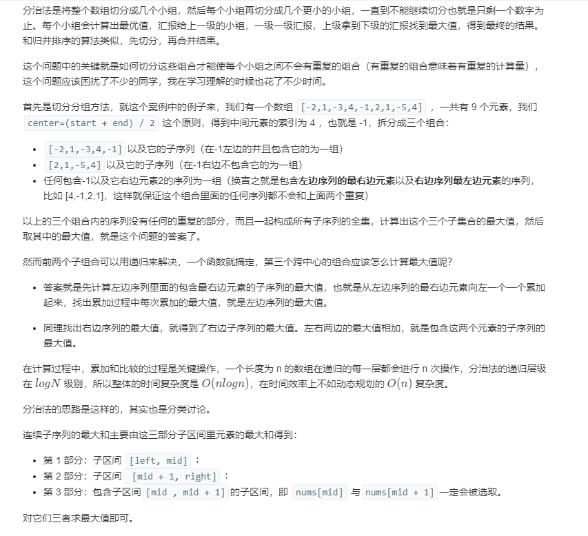
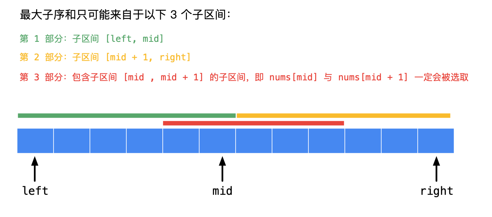

## Solution 1
> DP记录从左到右子数组的最大值，左边的负值抛弃
```java
class Solution {
    public int maxSubArray(int[] nums) {
        int len = nums.length; // 由于数组nums长度不为0，所以没有考虑n为零的情况
        int[] dp = new int[len + 1]; //这道题dp的长度为len也可以，[0...len)共len-1个元素，也就是len-1个状态
        dp[0] = nums[0];
        int maxSum = nums[0];

        for (int i = 1; i < len; i++) {
            dp[i] = nums[i] + (dp[i - 1] > 0 ? dp[i - 1] : 0); // 转移方程
            maxSum = Math.max(maxSum, dp[i]);
        }
        return maxSum;
    }
}
```
同样进行空间优化，没有必要每个位置的最大值都存储，用一个变量来迭代记录每个位置的最大值,状态压缩的办法
```java
class Solution {
    public int maxSubArray(int[] nums) {
        int len = nums.length;
        int maxSum = nums[0];
        int tempSum = nums[0];

        for (int i = 1; i < len; i++) {
            tempSum = Math.max(tempSum + nums[i], nums[i]); // 遍历到i时，看是否需要把前面的和加上
            maxSum = Math.max(maxSum, tempSum);
        }
        return maxSum;
    }
}
```

## Solution 2
> Divide and Conquer, Follow-up问题，时间复杂度为O(nlogn)，其实不如DP解法的时间复杂度



```java
class Solution {
    public int maxSubArray(int[] nums) {
        return maxSubArrayDivideWithBorder(nums, 0, nums.length-1);
    }

    private int maxSubArrayDivideWithBorder(int[] nums, int start, int end) {
        if (start == end) {
            // 只有一个元素，也就是递归的结束情况
            return nums[start];
        }

        // 计算中间值
        int mid = start + (end - start) / 2;
        int leftMax = maxSubArrayDivideWithBorder(nums, start, mid); // 计算左侧子序列最大值
        int rightMax = maxSubArrayDivideWithBorder(nums, mid + 1, end); // 计算右侧子序列最大值

        // 下面计算横跨两个子序列的最大值

        // 计算包含左侧子序列最后一个元素的子序列最大值
        int leftCrossMax = Integer.MIN_VALUE; // 初始化一个值
        int leftCrossSum = 0;
        for (int i = mid ; i >= start ; i --) {
            leftCrossSum += nums[i];
            leftCrossMax = Math.max(leftCrossSum, leftCrossMax);
        }

        // 计算包含右侧子序列最后一个元素的子序列最大值
        int rightCrossMax = nums[mid + 1];
        int rightCrossSum = 0;
        for (int i = mid + 1; i <= end ; i++) {
            rightCrossSum += nums[i];
            rightCrossMax = Math.max(rightCrossSum, rightCrossMax);
        }

        // 计算跨中心的子序列的最大值
        int crossMax = leftCrossMax + rightCrossMax;

        // 比较三者，返回最大值
        return Math.max(crossMax, Math.max(leftMax, rightMax));
    }
}
```

## Solution 3
> Kadane算法，与DP思路类似，了解即可

```java
class Solution {
    public int maxSubArray(int[] nums) {
        if (nums == null) {
            return 0;
        }

        int start = 0;
        int end = 0;
        int subStart = 0;
        int subEnd = 0;
        int max = nums[0];    // 全局最大值
        int subMax = nums[0];  // 前一个子组合的最大值
        for (int i = 1; i < nums.length; i++) {
            if (subMax > 0) {
                // 前一个子组合最大值大于0，正增益，更新最后元素位置
                subMax = subMax + nums[i];
                subEnd++;
            } else {
                // 前一个子组合最大值小于0，抛弃前面的结果，更新当前最大值位置
                subMax = nums[i];
                subStart = i;
                subEnd = i;
            }
            // 计算全局最大值，更新位置，将全局最优解的位置更新
            if (subMax > max) {
                max = subMax;
                start = subStart;
                end = subEnd;
            }
        }

        System.out.println("[" + start + ","+ end +"]");
        return max;
    }
}
```