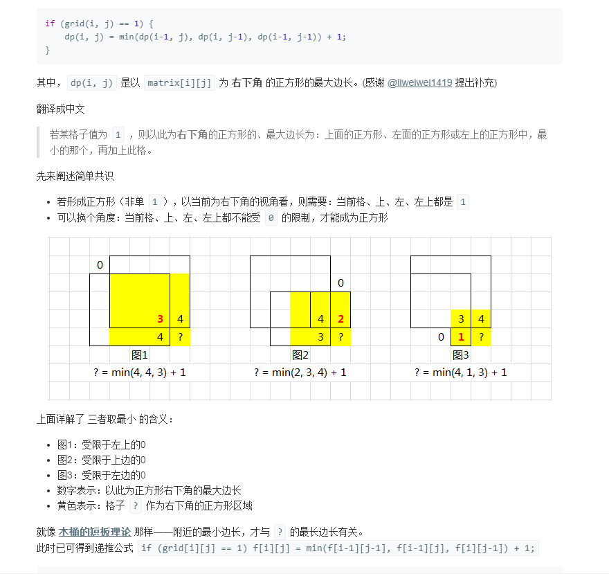

## Solution 1
> 暴力解法是O(n ^ 4)，使用DP，dp(i, j) 是以 matrix[i][j] 为 右下角 的正方形的最大边长，三个方向找最大

```java
class Solution {
    public int maximalSquare(char[][] matrix) {
        if (matrix == null || matrix.length == 0 || matrix[0].length == 0) {
            return 0;
        }
        int rows = matrix.length;
        int cols = matrix[0].length;
        int maxEdge = 0;

        // 已经预处理新增第一行、第一列default均为0
        int[][] dp = new int[rows + 1][cols + 1];

        for (int row = 0; row < rows; row++) {
            for (int col = 0; col < cols; col++) {
                if (matrix[row][col] == '1') {
                    dp[row + 1][col + 1] = Math.min(dp[row + 1][col], Math.min(dp[row][col + 1], dp[row][col])) + 1;
                    maxEdge = Math.max(maxEdge, dp[row + 1][col + 1]);
                }
            }
        }
        return maxEdge * maxEdge;
    }
}
```

优化空间
```java
class Solution {
    public int maximalSquare(char[][] matrix) {
        if (matrix == null || matrix.length == 0 || matrix[0].length == 0) {
            return 0;
        }
        // int rows = matrix.length;
        int cols = matrix[0].length;
        int maxEdge = 0;

        // 已经预处理新增第一行、第一列default均为0
        // int[][] dp = new int[rows + 1][cols + 1];
        int [] dp = new int[cols + 1];
        int northwest = 0; // 左上角

        // for (int row = 0; row < rows; row++) {
        for (char[] chars : matrix) {
            northwest = 0; // 遍历每行时，还原回辅助的原值0
            for (int col = 0; col < cols; col++) {
                int nextNorthwest = dp[col + 1];
                if (chars[col] == '1') {
                    // dp[row + 1][col + 1] = Math.min(dp[row + 1][col], Math.min(dp[row][col + 1], dp[row][col])) + 1;
                    dp[col + 1] = Math.min(northwest, Math.min(dp[col], dp[col + 1])) + 1;
                    maxEdge = Math.max(maxEdge, dp[col + 1]);
                } else {
                    dp[col + 1] = 0;
                }
                northwest = nextNorthwest;
            }
        }
        return maxEdge * maxEdge;
    }
}
```