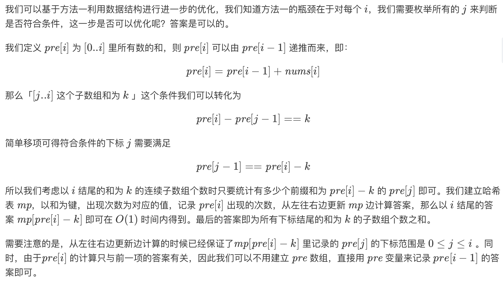

## Solution 1
> 暴力法开始，O(n^2)
```java
class Solution {
    public int subarraySum(int[] nums, int k) {
        int count = 0;
        if (nums == null || nums.length == 0) {
            return count;
        }
        for (int end = 0; end < nums.length; end++) {
            int sum = 0;
            for (int start = end; start >= 0; start--) { // 找前缀的子数组
                sum += nums[start];
                if (sum == k) { // 期间找到一个subarray
                    count++;
                }
            }
        }
        return count;
    }
}
```

## Solution 2
> 前缀树，O(n)，其实是在暴力法的基础上做记忆化。假设区间[start, end]的和为k，即前right项的和 - 前left项的和 = k,换句话说就是：前start项之和 = 前end项之和 - k. 因此我们可以遍历一遍数组，记录下前i项的和sum，用Map的健存储sum，Map的值存储sum出现的次数。假设当前扫到第i位，记录它的前i项和为sum，用该和减去k，即sum - k，判断sum - k是否为**i位置的前面某个位置**的前n项和（Hahsmap查找keys），若是，更新统计量。


```java
class Solution {
    public int subarraySum(int[] nums, int k) {
        int count = 0, pre = 0;
        HashMap <Integer, Integer> mp = new HashMap <>();
        mp.put(0, 1);
        for (int i = 0; i < nums.length; i++) {
            pre += nums[i];
            if (mp.containsKey(pre - k)) { // 到i位置时的和，减去k，等于前面某个位置的和
                count += mp.get(pre - k); // 找到的前面的位置的子数组数目
            }
            mp.put(pre, mp.getOrDefault(pre, 0) + 1);
        }
        return count;
    }
}
```