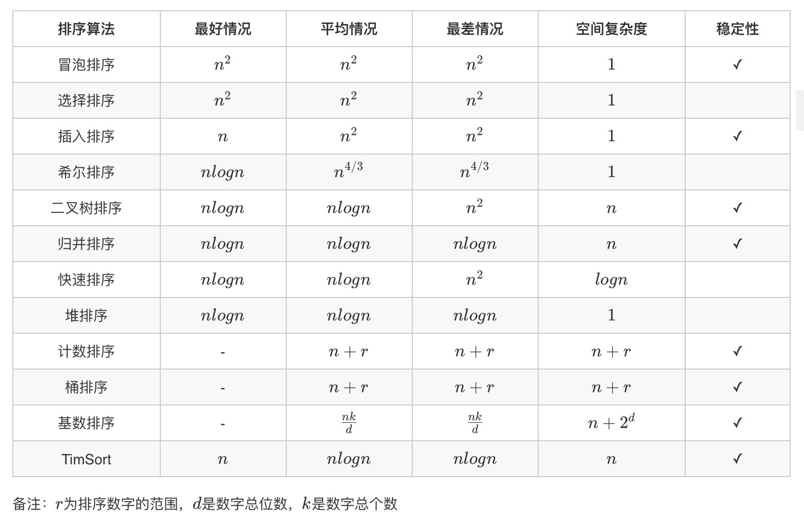

[各种排序Java实现](https://leetcode-cn.com/problems/sort-an-array/solution/shi-er-chong-pai-xu-suan-fa-bao-ni-man-yi-dai-gift/)
## 考察排序的老生常谈的问题，下面给出最应该掌握的3种

### 快速排序
```java

```

### 归并排序
```java

```

### 堆排序
> 调用PriorityQueue进行堆排序
```java
    class Solution {
        public int[] sortArray(int[] nums) {
            if (nums == null || nums.length <= 1) {
                return nums;
            }
            PriorityQueue<Integer> pq = new PriorityQueue<>();
            int[] result = new int[nums.length];

            for (int num : nums) {
                pq.offer(num);
            }
            // 这里之所以取出.size()大小，因为每一次poll()之后size大小都会变化，所以不能作为for循环的判断条件，否则有concurent错误
            int len = pq.size();
            // 堆排序只会保证第一个元素也就是根节点的元素是当前优先队列里最小（或者最大）的元素，在每一次变化之后，比如offer()或者poll()之后，才会进行堆重排
            for (int i = 0; i < len; i++) {
                result[i] = pq.poll();
            }
            return result;
        }    
    }
```

> 自己实现一个最小堆
```java
    class Solution {
        public int[] sortArray(int[] nums) {
            heapSort(nums);
            return nums;
        }    
        private void heapSort(int[] arr) {
            // 将待排序的序列构建成一个大顶堆
            for (int i = arr.length / 2; i >= 0; i--) { 
                heapAdjust(arr, i, arr.length); 
            }
            
            // 逐步将每个最大值的根节点与末尾元素交换，并且再调整二叉树，使其成为大顶堆
            for (int i = arr.length - 1; i > 0; i--) { 
                swap(arr, 0, i); // 将堆顶记录和当前未经排序子序列的最后一个记录交换
                heapAdjust(arr, 0, i); // 交换之后，需要重新检查堆是否符合大顶堆，不符合则要调整
            }
        }

        private void heapAdjust(int[] arr, int i, int n) {
            int child;
            int father; 
            for (father = arr[i]; leftChild(i) < n; i = child) {
                child = leftChild(i);
                
                // 如果左子树小于右子树，则需要比较右子树和父节点
                if (child != n - 1 && arr[child] < arr[child + 1]) {
                    child++; // 序号增1，指向右子树
                }
                
                // 如果父节点小于孩子结点，则需要交换
                if (father < arr[child]) {
                    arr[i] = arr[child];
                } else {
                    break; // 大顶堆结构未被破坏，不需要调整
                }
            }
            arr[i] = father;
        }

        // 获取到左孩子结点
        private int leftChild(int i) {
            return 2 * i + 1;
        }

        // 交换元素位置
        private void swap(int[] arr, int index1, int index2) {
            arr[index1] = arr[index1] ^ arr[index2];
            arr[index2] = arr[index1] ^ arr[index2];
            arr[index1] = arr[index1] ^ arr[index2];
        }
    }
```