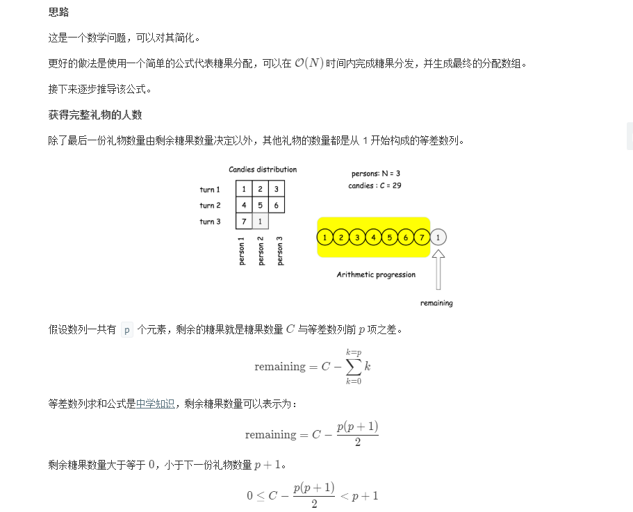
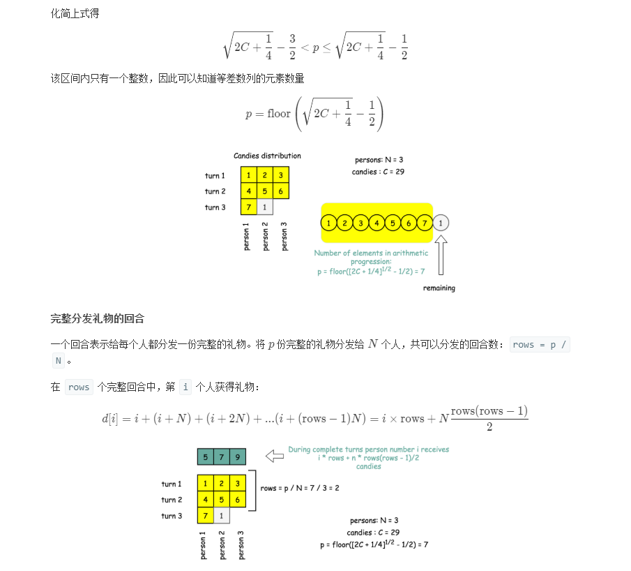
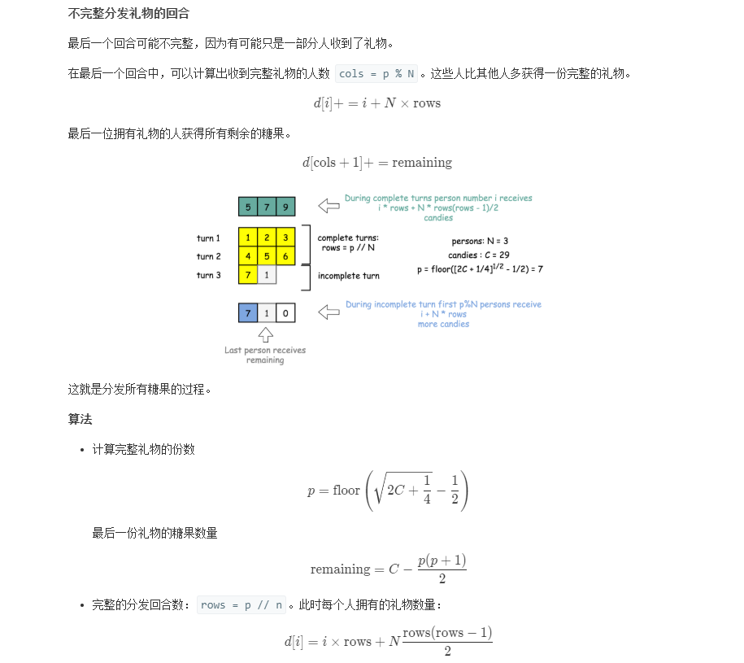

## Solution 1
> 暴力法，用一个array来模拟，直到发完位置，返回数组
```java
class Solution {
    public int[] distributeCandies(int candies, int num_people) {
        int[] result = new int[num_people];
        int index = 0;
        while (candies != 0) {
            // 从第0个小朋友开始分，index % num_people表示一轮完成
            result[index % num_people] += Math.min(candies, index + 1); // 看看剩下的糖果和改分的糖果哪个小就使用哪个值
            candies -= Math.min(candies, index + 1);
            index++;
        }
        return result;
    }
}
```

## Solution 2
> 等差数列求和




```java
class Solution {
    public int[] distributeCandies(int candies, int num_people) {
        int n = num_people;
        // how many people received complete gifts
        int p = (int)(Math.sqrt(2 * candies + 0.25) - 0.5);
        int remaining = (int)(candies - (p + 1) * p * 0.5);
        int rows = p / n, cols = p % n;

        int[] d = new int[n];
        for(int i = 0; i < n; ++i) {
            // complete rows
            d[i] = (i + 1) * rows + (int)(rows * (rows - 1) * 0.5) * n;
            // cols in the last row
            if (i < cols)  {
                d[i] += i + 1 + rows * n;
            }
        }
        // remaining candies        
        d[cols] += remaining;
        return d;
    }
}
```