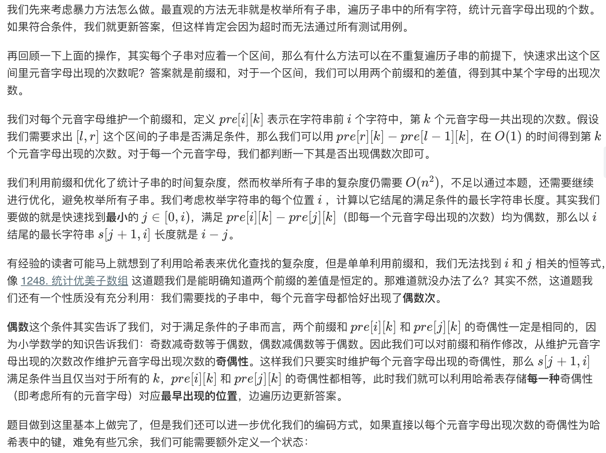
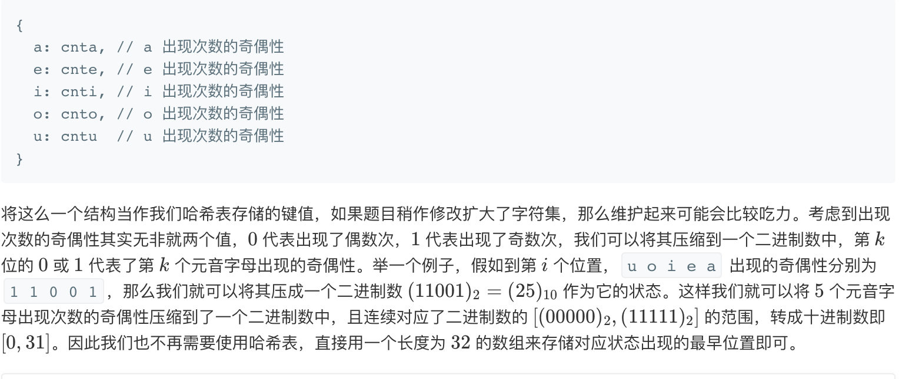

## Solution 1
> 具体的思路就是使用DP做前缀和，记录相同状态时的最大长度，元音出现的状态数共有2^5 = 32个，即每个元音的奇偶情况。状态压缩中使用异或来翻转特定位。dp[i]表示状态i最早出现的位置。



```java
class Solution {
    public int findTheLongestSubstring(String s) {
        int result = 0;
        if (s.isEmpty()) {
            return result;
        }
        int len = s.length();
        int[] dp = new int[1 << 5]; //int[] dp = new int[32];
        Arrays.fill(dp, -1);

        int status = 0;

        dp[0] = 0;
        for (int i = 0; i < len; i++) {
            char ch = s.charAt(i);
            switch (ch) {
                case 'a':
                    status ^= (1 << 0);
                    break;
                case 'e':
                    status ^= (1 << 1);
                    break;
                case 'i':
                    status ^= (1 << 2);
                    break;
                case 'o':
                    status ^= (1 << 3);
                    break;
                case 'u':
                    status ^= (1 << 4);
                    break;
            }
            if (dp[status] >= 0) {
                result = Math.max(result, i + 1 - dp[status]);
            } else {
                dp[status] = i + 1;
            }
        }
        return result;
    }
}
```

## Solution 2
> 哈希表的做法
```java

```