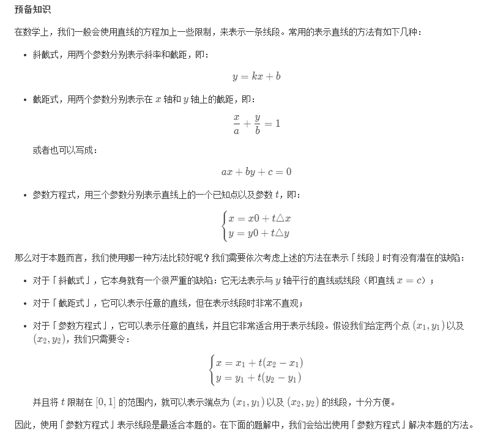

## Solution 1

```markdown
1. 其中一条直线平行于 X 轴或 Y 轴
    1.1 第一条直线平行于 X 轴
        1.1.1 第二条直线也平行于 X 轴
            1.1.1.1 两条线段有重叠
            1.1.1.2 两条线段无重叠（判断上一条之后可以省略）
        1.1.2 另一条直线不平行于此直线 (等同于另一条直线不平行于X轴)
    1.2 第一条直线平行于 Y 轴，可以将两条线段沿y=x翻折，即 x、y 坐标对调，此时形如(1.1)平行于 X 轴时的情况，将得到的交点再沿y=x翻折回来
    1.3 第二条直线平行于 X 轴，可以将两条线段对调，此时形如(1.1)中的情况
    1.4 第二条直线平行于 Y 轴，可以将两条线段对调，此时形如(1.2)中的情况
2. 两条直线平行，但不平行于 X 轴或 Y 轴，比较端点的大小，其中一个端点为解
3. 普通情况，联立两点式求解
```
```java
class Solution {
    public double[] intersection(int[] start1, int[] end1, int[] start2, int[] end2) {
        double x = 0;
        double y = 0;
        double x1 = start1[0], y1 = start1[1],
               x2 = end1[0],   y2 = end1[1],
               x3 = start2[0], y3 = start2[1],
               x4 = end2[0],   y4 = end2[1];

        // 第一条直线平行于X轴
        if (x1 - x2 == 0) {
            // 第二条直线也平行于X轴
            if (x3 - x4 == 0) {
                // 两条直线有重叠 - 为同一直线，且一个端点在另一条线段之内
                if (x1 == x3 && Math.max(y1, y2) >= Math.min(y3, y4) && Math.min(y1, y2) <= Math.max(y3, y4)) {
                    return new double[] {x1, Math.max(Math.min(y1, y2), Math.min(y3, y4))};
                }
            } else { // 另一条直线不平行于第一条直线（X轴）
                x = x1;
                y = (x - x4) * (y3 - y4) / (x3 - x4) + y4;
            }
        } else if (y1 - y2 == 0){ //第一条直线平行于Y轴
            // 四个端点的对称点
            int[] newStart1 = new int[]{start1[1], start1[0]},
                  newEnd1   = new int[]{end1[1], end1[0]},
                  newStart2 = new int[]{start2[1], start2[0]},
                  newEnd2   = new int[]{end2[1], end2[0]};
            double[] temp = intersection(newStart1, newEnd1, newStart2, newEnd2);
            return new double[] {temp[1], temp[0]};
        } else if (x3 - x4 == 0) {// 第二条直线平行于X轴
            return intersection(start2, end2, start1, end1);
        } else if (y3 - y4 == 0) {// 第二条直线平行于Y轴
            return intersection(start2, end2, start1, end1);
            // 两条直线平行，但不平行于X或者Y轴
        } else if ((y1 - y2) / (x1 - x2) == (y3 - y4) / (x3 - x4) &&
                    x2 * (y2 -  y1) / (x1 - x2) + y2 == x4 * (y4 - y3) / (x3 - x4) + y4) {
                        x = Math.max(Math.min(x1, x2), Math.min(x3, x4));
                        y = Math.max(Math.min(y1, y2), Math.min(y3, y4));
        // 普通相交情况
        } else {
            x = ((y4 - y2) * (x1 - x2) * (x3 - x4) + x2 * (y1 - y2) * (x3 - x4) - x4 * (y3 - y4) * (x1 - x2))
                    / ((y1 - y2) * (x3 - x4) - (y3 - y4) * (x1 - x2));
            y = (x - x2) * (y1 - y2) / (x1 - x2) + y2;
        }
        // 交点可能存在的左、右、下、上边界
        double  left    = Math.max(Math.min(x1, x2), Math.min(x3, x4)),
                right   = Math.min(Math.max(x1, x2), Math.max(x3, x4)),
                bottom  = Math.max(Math.min(y1, y2), Math.min(y3, y4)),
                top     = Math.min(Math.max(y1, y2), Math.max(y3, y4));

        if (left <= x && x <= right && bottom <= y && y <= top) {
            return new double[] {x, y};
        } 
        return new double[] {};
    }
}
```

## Solution 2
> 叉积法