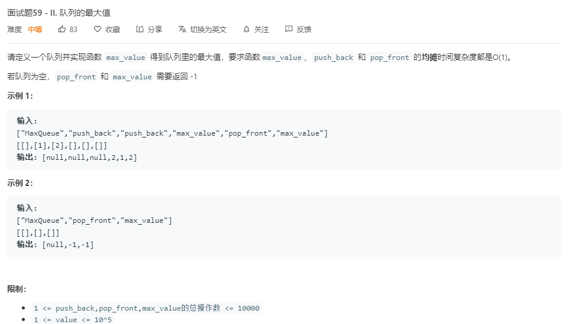

## Solution 1



[借鉴](https://leetcode-cn.com/problems/dui-lie-de-zui-da-zhi-lcof/solution/mian-shi-ti-59-ii-dui-lie-de-zui-da-zhi-by-leetcod/)

```java
class MaxQueue {
    Deque<Integer> back_deque;
    Deque<Integer> deque;
    public MaxQueue() {
        back_deque = new LinkedList<Integer>();
        deque = new LinkedList<Integer>();
    }
    
    public int max_value() {
        if (deque.isEmpty()) {
            return -1;
        }
        return deque.peekFirst();
    }
    
    public void push_back(int value) {
        while (!deque.isEmpty() && deque.peekLast() < value) {
            deque.pollLast();
        }
        deque.offerLast(value);
        back_deque.offer(value);
    }
    
    public int pop_front() {
        if (back_deque.isEmpty()) {
            return -1;
        }
        int answer = back_deque.pollFirst();
        if (answer == deque.peekFirst()) {
            deque.pollFirst();
        }
        return answer;
    }
}

/**
 * Your MaxQueue object will be instantiated and called as such:
 * MaxQueue obj = new MaxQueue();
 * int param_1 = obj.max_value();
 * obj.push_back(value);
 * int param_3 = obj.pop_front();
 */
```