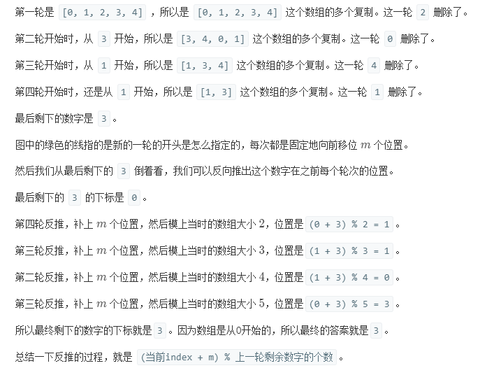

## Solution 1
> 暴力解法，用ArrayList来模拟过程，时间复杂度O(n<sup>2</sup>),删除n-1次，remove的时间复杂度为n；用LinkedList来模拟会超时，应该是因为每次再查找新删除元素的时候会从头查起，又多了个线性时间，而ArrayList查找则是常数时间

```java
    class Solution {
        public int lastRemaining(int n, int m) {
            ArrayList<Integer> list = new ArrayList<>();
            for (int i = 0; i < n; i++) {
                list.add(i);
            }

            int index = 0;
            while (n > 1) {
                index = (index + m - 1) % n;
                list.remove(index);
                n--;
            }
            return list.get(0);
        }
    }
```

## Solution 2
> 数学法，时间为O(n), (约瑟夫环的数学解法)


```java
    class Solution {
        public int lastRemaining(int n, int m) {
            int result = 0;

            // 最后一轮剩两个数字，从2开始进行反推
            for (int i = 2; i <= n; i++) {
                result = (result + m) % i;
            }
            
            return result;
        }
    }
```
