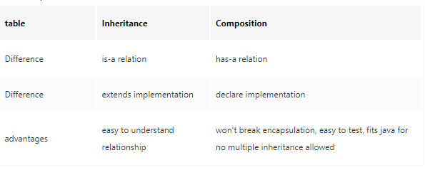

## System Internals:

### 1 Graph(CPU usage, RAM usage), 大概就是随着time，CPU资源消耗不变, increase;
 
How to detect; - top in linux

What could cause that; 
maybe memory leak; virus

How to resolve?

### 2 Memory Leak, how to solve?

Memory Leak: some objects are referenced, but not used

Symptoms of a Memory leak: Works fast at first, but slows over time; OutOfMemoryError after runing; There are occasionally crashes in the applications.

    Why

       1. Memory Leak Through static Fields

       2. Through Unclosed Resources

       3. Improper equals() and hashCode() Implementations

    Handle:

       1. Enable Profiling: Java profilers are tools that monitor and diagnose the memory leaks through the application.
       2. Verbose Garbage Collection: enable verbose garbage collection to track detailed trace of GC
       3. use tools like JConsole/Intellij to show warnings and errors whenever it encounters obvious cases of memory leaks
       4. use benchmarks to measure and analyze the Java code's performance after changed code.
       5. Code Reviews

### 3 Connection Pool Timeout
This value indicates the number of seconds that a connection request waits when there are no connections available in the free pool and no new connections can be created.

Handle: 
Check connection pool configurations and logs about connection use/idle messages; also check code for correct usage and relasing.

### 4. Thread Exhausion
Thread exhaustion arise when you generate more tasks than your ThreadPool can handle.

Handle: Use Asynchronous code (including async/await) with fewer threads to avoid blocking threads.

### 5. How do you know if you can handle 1k requests per second (now it's 1 request per second)
load test with mocked production data

### 6 操作系统中进程和线程的区别。
Both processes and threads are independent sequences of execution. The typical difference is that threads (of the same process) run in a shared memory space, while processes run in separate memory spaces.

Each process provides the resources needed to execute a program. Each process is started with a single thread, often called the primary thread, but can create additional threads from any of its threads.
A thread is an entity within a process that can be scheduled for execution.

### 7 What is garbage collection
Once an object is no longer referenced and therefore is not reachable by the application code, the garbage collector removes it and reclaims the unused memory.

### 8 stack vs heap
Heap memory is used by all the parts of the application whereas stack memory is used only by one thread of execution. When an object is created, it's mostly stored in the Heap space and stack memory contains the reference to it.

### 9 How to communicate between threads? How to communicate between processes?
Thread communicate via shared memory. The information is exchanged over objects by locking and notification.

The communication of the different processes with each other on the same machine use the IPC (inter process communication). IPC have different mechanism PIPE, FIFO, message queue, semaphore, shared memory etc.

### 10 What is the difference between garbage collection and 传统的内存管理方法?
Explain Garbage collection, then
Garbage collection can automatically handle the deletion of unused objects or some objects that are inaccessible to free up memory resources.

In traditional forms of memory management, programmers need to do this by themselves.

### 11 给一个场景不太适合使用garbage collection模型去管理内存
Online services which need low latency and keep communication with users (no "stop the world" time interval)

## Object-oriented design

### 1. 简单描述下composition 跟inheritance 以及他们的区别。

Inheritance is an "is-a" relationship. Composition is a "has-a" relationship.

Composition and Inheritance both provide code reusability by relating class.

Inheritance derives one class from another one class, composition can have an instance of another class as a field.

### 2.What is dependency injection(DI)? 对管理软件有什么好处?
Dependency Injection is a technique where an object receives other objects that it depends on.

DI is a design pattern used to implement IoC. By DI, the responsibility of creating objects is shifted from our application code to the Spring container; this phenomenon is called Inversion of Control (IoC). The injection can be constructor injection(recommended) or setter injection or field injection.

Advantages: Dependency injection makes testing easier and DI is an approach to implement loose coupling among the classes in an application. faster to use objects.

Disadvantages: Code is difficult to trace and read in Dependency Injection, it increases complexity in the linkages between classes.

### 3.Polymorphism
Polymorphism means "many forms", it means to have different functions in different situation, just like functions keys on keyboard, same key but with different functions in different pages. B,C,D inherits from A and have same function but performs differently when is called. It describes the concept that different classes can be used with the same interface.

Advantages: It helps the programmer to reuse the codes

Disadvantages: Polymorphism reduces the readability of the program and runtime polymorphism can lead to the performance issue as machine needs to decide which method or variable to invoke

### 4.what is the most important object oriented programming principle for complex system
Four basic concept:

Abstraction: shows only the necessary details to the client of an object

Encapsulation: process of enclosing one or more items within a physical or logical package

Inheritance: allows us to define a class in terms of another class

Polymorphism: an instance of something in various forms

The five principles are as follows:

* S – Single Responsibility Principle (SRP): “A class should have one, and only one, reason to change.”

* O – Open Closed Principle (OCP): “You should be able to extend a classes behavior, without modifying.”

* L – Liskov Substitution Principle (LSP): “Derived classes must be substitutable for their base classes.”

* I – Interface Segregation Principle (ISP): “Clients should not be forced to depend upon interfaces that they don't use.”

* D – Dependency Inversion Principle (DIP): “Depend on abstraction, not on concretions.”

### 5.如果向Collection framework里面加入一个新的class. 你打算加上哪些文档?
跟一般API文档相比，看重的是细节，比如是否修改原数据，返回数据是否有序，接受input的range，是不是线程safe，时间空间效率等等

### 6.公司实现了一个数据结构，你觉得documentation里头要写啥比较好，随便讲
    @author（只出现在类和接口的文档中）
    @version（只出现在类和接口的文档中）
    @param（只出现在方法或构造器的文档中）
    @return（只出现在方法中）
    @exception（从java1.2之后也可以使用@thrown替代）
    @see
    @since
    @serial（也可以使用@serialField或@serialData替代）
    @deprecated
more examples

### 7.undo/redo , which data structure is good for this?
stack

### 8.What is the main difference between overloading and overriding?
Overloading is static Binding, whereas Overriding is dynamic Binding. 

Overloading is nothing but the same method with different arguments, and it may or may not return the equal value in the same class itself. Overriding is the same method names with the same arguments and return types associated with the class and its child class.

### 9. What is Static Binding and Dynamic Binding?
Binding is nothing but the association of a name with the class. 

Static Binding is a binding in which name can be associated wi‍‌‍‍‍‌‌‍‌‌‌‌‌‍‍‍‌‌th the class during compilation time, and it is also called as early Binding.

Dynamic Binding is a binding in which name can be associated with the class during execution time, and it is also called as Late Binding.

### 10.When would you use composition and inheritance over the other, what are some of the tradeoffs?
Does TypeB want to expose the complete interface (all public methods no less) of TypeA such that TypeB can be used where TypeA is expected? Indicates Inheritance. "is-a" relationship

Does TypeB want only some/part of the behavior exposed by TypeA? Indicates need for Composition. "has-a" relationship